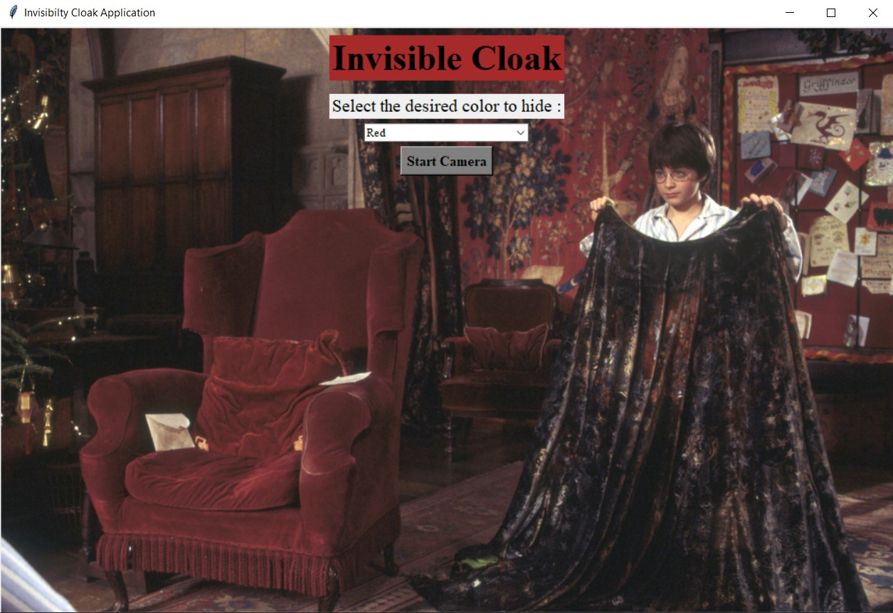

# Invisible Cloak

_Get invisible using a magical cloak just like in Harry Potter Movies._

## Description

This is a simple yet very intriguing project made by Image Processing using OpenCV and Numpy. It is implemented using 2 methods : 
- Command Line Tool
- GUI tool

## What actually (roughly) happens behind the scene?

* Camera captures inital background image for about 2 seconds.
* A color is chosen for processing.
* Real time Video Frames are captured and converted from BGR color space to HSV/HSB color space.
* It is then processed and all occurance of eariler chosen color (red) is replaced by the initial background image which we have captured earlier.
* For this a HSV/HSB range is defined  which is to be replaced. For red colour, Hue(H) = 0 - 10 and 160 - 180, Saturation(S) = 120 - 255 and Brightness(B) = 70 - 255.
For Blue colour, Hue(H) = 94 - 126, Saturation(S) = 80 - 255 and Brightness(B) = 2 - 255.
For Green colour, Hue(H) = 25 - 102, Saturation(S) = 52 - 255 and Brightness(B) = 72 - 255.
* **For CLI Tool -** Argument parser is used to obtain the color argument from the command line and then it hides that color from the camera feed.
* **For GUI Tool -** Tkinter is used to create the GUI application which includes a dropdown list for colors to chose and appropriate buttons to start and stop camer. Also Harry Potter theme is used as background image and music.

## How to run locally?

### Libraries Used
- OpenCV
- Numpy
- Pygame
- Tkinter
- Pillow

### Setup Guide
* Clone the repository - `git clone https://github.com/pirateksh/invisible-cloak.git`
* Change directory to invisible-cloak `cd invisible-cloak`
* Install relevant libraries - `pip install opencv-python numpy pygame tk Pillow`
* Run `python stream.py -c <color_of_cloak>` if you want to run CLI tool
* Run `python desktop_gui.py` if you want to run GUI tool.

## Screenshot

